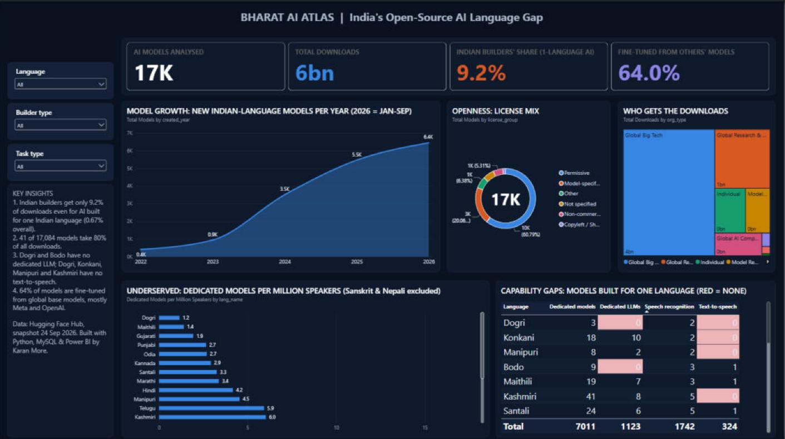
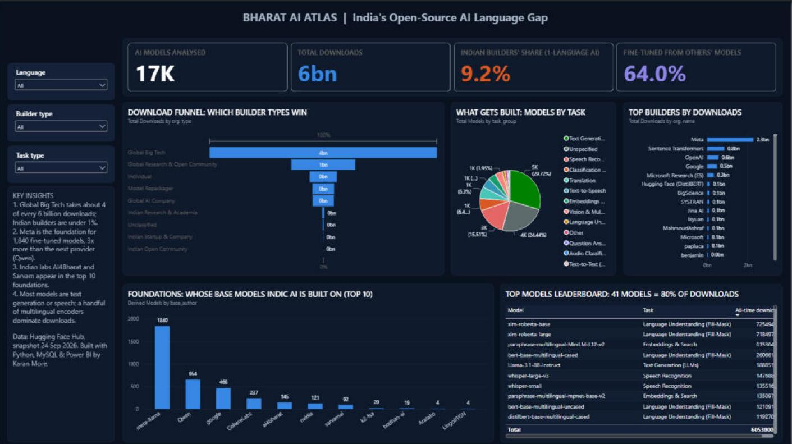
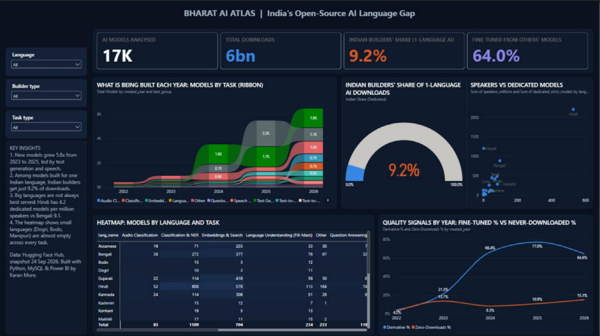

# 🇮🇳 Bharat AI Atlas: Mapping India's Open-Source AI Language Gap

> **India has 22 official languages. How much open-source AI exists for each of them, who builds it, and does anyone use it?**

An end-to-end analytics project: data is collected from the **Hugging Face Hub API** with Python, modeled in **MySQL**, analyzed with **SQL**, and presented in a 3-page **Power BI** dashboard.



---

## 🔑 Key findings
*Hugging Face snapshot of 24 Sep 2026. Details, sources and caveats: [docs/findings.md](docs/findings.md).*

> **Even among AI models built for a single Indian language, Indian builders get only 9% of the downloads.**
> Across all Indian-language AI, their share is 0.67%.

- **17,084 models** cover India's 22 official languages, but only **7,011** are built for a single Indian language. **5 languages have fewer than 20 dedicated models**: Dogri (3), Manipuri (8), Bodo (9), Konkani (18) and Maithili (19).
- **Hindi** has the most models (11,350), but per million speakers it ranks **last of 21** (Sanskrit excluded).
- Every language has speech-recognition models, but **2 languages have no dedicated LLM** (Dogri, Bodo) and **4 have no dedicated text-to-speech model** (Dogri, Manipuri, Kashmiri, Konkani).
- Just **41 models get 80%** of all downloads, and the **top 10 get 52.3%**. **11.8%** of models have never been downloaded.
- **64%** of models are built on another model, most often from **Meta** (2,174 models) and **OpenAI** (1,181).
- **Global Big Tech** published 1.4% of the models but gets **62.4% of downloads**.

## ❓ Business questions
1. **Coverage:** Which languages are served and which are left behind (models per million speakers)?
2. **Growth:** How fast is Indic AI growing year over year?
3. **Builders:** Indian research, Indian startups, global big tech, or individuals?
4. **Usage:** Are models actually downloaded, or only published?
5. **Foundations:** Whose base models does Indic AI build on?
6. **Capability gaps:** Which languages lack an LLM, speech recognition or text-to-speech?
7. **Openness:** Which licenses are used, and can businesses use them?

## 🏗️ Architecture
```
Hugging Face Hub API
        │  Python (huggingface_hub, pandas)
        ▼
data/raw/  dated raw snapshots
        │  clean.py: dedupe, license & base-model parsing, task grouping, builder classification
        ▼
data/processed/  analysis-ready tables
        │  load_to_sql.py (SQLAlchemy)
        ▼
MySQL: star schema + weekly history + reporting views
        │  25 SQL analysis queries
        ▼
Power BI: 3-page interactive dashboard
```

## 🗄️ Data model
```
organizations 1 ──< models 1 ──< model_languages >── 1 languages
                        └──< model_snapshots (weekly history)
```
| Table | Grain |
|---|---|
| `models` | one row per model (task, license, base model, downloads, likes, created date, `is_india_dedicated`) |
| `languages` | 22 official languages + Census 2011 speakers |
| `organizations` | Hugging Face author → organization, type, Indian/foreign |
| `model_languages` | bridge: model ↔ language (many-to-many) |
| `model_snapshots` | downloads/likes per model per collection date |

### What counts as a "dedicated" model?
Many big global models list one Indian language among dozens of others. To separate them from models actually built for an Indian language, `is_india_dedicated = 1` when **both** are true:
1. The model is tagged with **exactly one** of the 22 official languages, **and**
2. **At least half of its non-English language tags are Indian languages.** Language tags are 2–3 letter tags such as `hi`, `mar` or `fr`, excluding short non-language tags such as `mlx` or `tts`. Indian languages include the 22 official languages plus regional ones such as Bhojpuri and Tulu.

English is ignored, so an English + Marathi model counts as dedicated, but Llama-3.1-8B-Instruct (English, German, French, Italian, Portuguese, Hindi, Spanish, Thai) does not. 7,011 of 17,084 models qualify. The rule lives in `src/clean.py`.

## 📊 Dashboard
`dashboard/bharat_ai_atlas_final.pbix` loads its tables from the CSVs in `data/powerbi/` (generated by [`src/export_for_powerbi.py`](src/export_for_powerbi.py) — re-run the pipeline and hit **Refresh** in Power BI to pull in new data). It has 3 pages:

1. **Executive Dashboard** — KPI cards (models analysed, total downloads, Indian builders' share, % fine-tuned from others' models); treemap of downloads by builder type; table of per-language coverage (dedicated models, LLMs, speech recognition, TTS); donut chart of models by license; clustered bar chart of dedicated models per million speakers by language; area chart of models created per year.

   

2. **Builders & Foundations** — KPI cards; pie chart of models by task; bar chart of downloads by organization; funnel chart of downloads by builder type; clustered column chart of derived models by base-model provider; table of top models by downloads.

   

3. **Languages & Trends** — KPI cards; line chart of derivative-% and zero-download-% by year; gauge of the Indian builders' share; scatter chart of speakers vs. dedicated models per language; pivot table of models by language × task; ribbon chart of models per year by task.

   

## 🧰 Tech stack
| Stage | Tools |
|---|---|
| Collection | Python, `huggingface_hub` |
| Cleaning | pandas |
| Storage | MySQL 8, SQLAlchemy, PyMySQL |
| Analysis | SQL (CTEs, window functions, views) |
| Visualization | Power BI (DAX) |

## ▶️ How to run
```bash
git clone https://github.com/Karan-More214/Bharat-AI-Atlas.git
cd Bharat-AI-Atlas
python -m venv venv && venv\Scripts\activate      # Mac/Linux: source venv/bin/activate
pip install -r requirements.txt
copy .env.example .env                             # add your HF token + MySQL credentials
python src/run_pipeline.py                         # collect → clean → load
```
Then run `sql/analysis.sql` in MySQL Workbench and open `dashboard/bharat_ai_atlas_final.pbix`.

## 📁 Repository structure
```
├── config/            languages.csv (22 languages + speakers), author_mapping.csv
├── src/               collect.py, clean.py, load_to_sql.py, run_pipeline.py
├── sql/               schema.sql, views.sql, analysis.sql
├── data/sample/       small sample of the processed data
├── dashboard/         Power BI file + screenshots
└── docs/              findings.md
```

## ⚠️ Limitations
- Only models **tagged** with a language on Hugging Face are counted; untagged models are missed.
- `downloads_30d` covers the last 30 days; `downloads_all_time` is cumulative.
- Bengali, Urdu, Nepali, Punjabi and Sindhi are also spoken outside India, so some models target neighboring countries.
- Speaker counts are from Census 2011 (first language). Sanskrit is excluded from per-speaker charts.
- Builder classification is manual for 215 authors. They cover 99.7% of downloads but only 29% of models; the long tail of small authors is "Unclassified". Individuals have `is_indian` left blank, so the Indian share is a floor.
- `downloads_all_time` is global, so it measures a model's popularity, not its use in India. The most-downloaded models (XLM-RoBERTa, Whisper, Llama) are general multilingual models.
- Models created before March 2022 all carry Hugging Face's placeholder date 2022-03-02. Their `created_year` is set to NULL (`date_is_placeholder = 1`).
- Some language tags are wrong (e.g. a Portuguese speech model tagged Hindi). One author accounts for about 20% of Nepali models (830 near-identical fine-tunes).

## 🚀 Next steps
- Add Hugging Face **datasets** and **Spaces** to measure data availability and real apps.
- Build a composite **Language AI Readiness Score**.
- Track trends from weekly snapshots.

---
**Author:** [Your Name] · [LinkedIn](https://linkedin.com/in/your-profile) <!-- TODO: fill in your name and LinkedIn --> · [GitHub](https://github.com/Karan-More214) · Data: [Hugging Face Hub](https://huggingface.co), Census of India 2011
